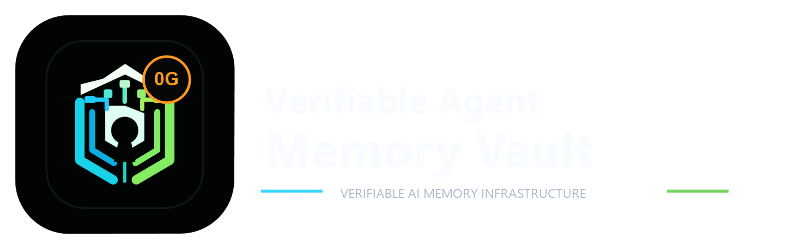
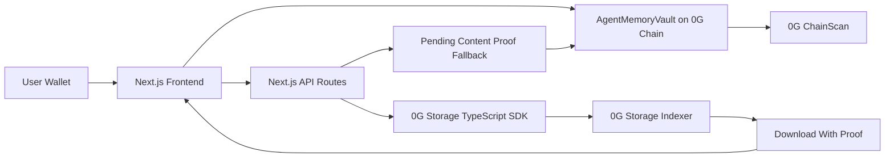

# Verifiable Agent Memory Vault



AI agent memory and execution logs with verifiable provenance on 0G.

Built for the 0G APAC Hackathon.

## Project Overview

Verifiable Agent Memory Vault is a Next.js dApp that lets users create AI agents, attach memory or execution logs, and anchor proof references on 0G Chain. The intended storage path uploads the underlying agent metadata and memory artifacts to 0G Storage, then records the storage root, storage transaction reference, and content hash on-chain.

The current deployed MVP includes a fallback-safe demo path: if the local environment cannot reach the 0G Storage indexer, the app still creates deterministic content proofs and anchors them on 0G Chain while clearly marking the artifact as `storageStatus: "pending"`.

## Problem

AI agents are becoming more autonomous, but their memory and execution history are often opaque. Users and reviewers cannot easily answer:

- What did this agent know when it acted?
- Which memory or log produced this output?
- Has the memory changed since it was used?
- Can the record be checked independently?

For agentic applications to be trusted, memory and logs need durable storage plus verifiable provenance.

## Solution

This MVP provides a vault for agent memory artifacts:

- Agent metadata is prepared as a canonical JSON artifact.
- Memory and execution logs are content-hashed.
- Artifacts are uploaded to 0G Storage when the indexer is reachable.
- Proof references are anchored on 0G Chain through `AgentMemoryVault`.
- The UI exposes root hashes, content hashes, transaction links, and verification state.
- A separate restore path lets reviewers retry real 0G Storage upload for pending artifacts without breaking the working on-chain flow.

## 0G Components Used

- **0G Chain:** EVM-compatible deployment and proof anchoring.
- **0G Storage:** decentralized storage target for agent metadata, memory, and execution logs.
- **0G ChainScan:** explorer proof for contract deployment and on-chain transactions.

Network values:

- Chain ID: `16661`
- RPC URL: `https://evmrpc.0g.ai`
- Storage Indexer: `https://indexer-storage-turbo.0g.ai`
- Explorer: `https://chainscan.0g.ai`

## Deployment

Contract:

```text
0x1d3a911683292b48439Ad3e003c6129E96c74f2e
```

Explorer:

```text
https://chainscan.0g.ai/address/0x1d3a911683292b48439Ad3e003c6129E96c74f2e
```

Deployment record:

```text
deployments/ogMainnet.json
```

## Architecture



## Folder Structure

```text
.
├── app
│   ├── api
│   │   ├── health/route.ts
│   │   ├── memory/restore-upload/route.ts
│   │   ├── memory/upload/route.ts
│   │   └── proof/verify/route.ts
│   ├── globals.css
│   ├── layout.tsx
│   └── page.tsx
├── contracts
│   └── AgentMemoryVault.sol
├── deployments
│   └── ogMainnet.json
├── scripts
│   ├── deploy.js
│   └── rpc-proxy.ps1
├── src
│   ├── components
│   │   └── MemoryVaultApp.tsx
│   └── lib
│       ├── agentMemoryVaultAbi.ts
│       ├── config.ts
│       └── ogStorage.ts
├── hardhat.config.js
├── package.json
└── README.md
```

## Smart Contract

`contracts/AgentMemoryVault.sol` stores:

- Agent owner, name, description, metadata root hash, creation timestamp, and active status.
- Memory records keyed by agent ID and memory index.
- Memory type, storage root hash, storage transaction reference, SHA-256 content hash, and creation timestamp.

Primary functions:

- `registerAgent(name, description, metadataRootHash)`
- `anchorMemory(agentId, memoryType, storageRootHash, storageTxHash, contentHash)`
- `getAgent(agentId)`
- `getMemory(agentId, index)`
- `getOwnerAgents(owner)`

## Fallback Storage Behavior

The intended path is real 0G Storage upload through `@0gfoundation/0g-storage-ts-sdk`.

During local testing, this machine could reach 0G Chain through a local RPC proxy but could not reach the 0G Storage indexer endpoint. To keep the demo honest and usable:

- The default upload API first attempts a real 0G Storage upload.
- If the storage indexer is unreachable, the API returns a deterministic Merkle root/content hash and marks the artifact as `storageStatus: "pending"`.
- The UI displays the pending state and the storage error clearly.
- The app can still register agents and anchor memory proofs on 0G Chain.
- The separate `POST /api/memory/restore-upload` route retries real 0G Storage upload for a pending artifact.
- Failed restore attempts do not overwrite or break the current on-chain fallback state.

This fallback is not represented as a successful 0G Storage upload. It is an explicit degraded mode for network/indexer unavailability.

## Environment Variables

Create `.env` and `.env.local` from `.env.example`.

```bash
NEXT_PUBLIC_0G_CHAIN_ID=16661
NEXT_PUBLIC_0G_CHAIN_NAME=0G Mainnet
NEXT_PUBLIC_0G_RPC_URL=https://evmrpc.0g.ai
NEXT_PUBLIC_0G_EXPLORER_URL=https://chainscan.0g.ai
NEXT_PUBLIC_0G_STORAGE_INDEXER_URL=https://indexer-storage-turbo.0g.ai
SERVER_0G_RPC_URL=http://127.0.0.1:18545
SERVER_0G_STORAGE_INDEXER_URL=https://indexer-storage-turbo.0g.ai
SERVER_0G_STORAGE_INDEXER_URLS=https://indexer-storage-turbo.0g.ai,http://127.0.0.1:18546,http://indexer-storage-turbo.0g.ai
NEXT_PUBLIC_AGENT_MEMORY_VAULT_ADDRESS=0x1d3a911683292b48439Ad3e003c6129E96c74f2e
PRIVATE_KEY=
OG_CHAINSCAN_API_KEY=not-required
```

Notes:

- `PRIVATE_KEY` must be a funded 0G Mainnet wallet key.
- Never commit or share `.env` or `.env.local`.
- `SERVER_0G_RPC_URL` is server-only and points to the local RPC proxy used by this environment.
- `SERVER_0G_STORAGE_INDEXER_URLS` is a comma-separated failover list used only by server-side upload and proof routes.
- `NEXT_PUBLIC_0G_RPC_URL` remains the public wallet/network RPC.

## Setup Steps

1. Install dependencies.

```bash
npm install
```

2. Create environment files.

```bash
copy .env.example .env
copy .env.example .env.local
```

3. Add your funded wallet key locally.

```bash
PRIVATE_KEY=<your private key>
```

Do not paste the private key into chat, screenshots, commits, or issue reports.

4. Compile the contract.

```bash
npm run compile
```

5. Start the local RPC proxy if Node cannot connect directly to the 0G RPC.

```bash
npm run rpc:proxy
```

6. Optionally start a local storage-indexer proxy in another terminal.

```bash
npm run storage:proxy
```

This is a fallback transport attempt for environments where Node has trouble reaching the remote storage indexer directly.

7. Deploy if needed.

```bash
npm run deploy:0g
```

8. Start the app.

```bash
npm run dev
```

9. Open:

```text
http://127.0.0.1:3000
```

## Demo Flow

### Guest demo mode

Judges can click **Try Demo** before connecting a wallet. This loads clearly labeled sample demo data:

- One sample agent.
- One sample memory artifact.
- A verified sample proof state.
- The Create Agent -> Anchor Memory -> Verify Proof flow without a wallet prompt.

The sample mode does not claim to be a live 0G transaction. Live 0G Chain and 0G Storage actions still require wallet connection and the configured production endpoints.

### Live wallet flow

1. Open the app and connect a wallet.
2. Confirm the wallet is on 0G Mainnet.
3. Register an agent.
4. Show the agent metadata root and content hash.
5. Open the 0G Chain transaction or contract in ChainScan.
6. Add a memory or execution log.
7. Anchor the memory proof on 0G Chain.
8. Show the latest proof artifact panel.
9. If `storageStatus` is pending, explain that the indexer was unreachable locally and click **Retry real 0G upload** to demonstrate the safe restore path.
10. If real storage upload succeeds, verify the artifact from the Proof Verification panel.

## Judge-Facing Architecture Path

```text
Wallet
  -> Next.js Frontend
  -> AgentMemoryVault on 0G Chain
  -> Next.js API
  -> 0G Storage SDK
  -> 0G Storage Indexer
  -> Proof Verification
```

## API Routes

### `POST /api/memory/upload`

Default upload path. Attempts real 0G Storage upload and falls back to a pending content proof if the indexer is unreachable.

### `POST /api/memory/restore-upload`

Strict retry path for pending artifacts. Attempts real 0G Storage upload without using the fallback.

### `POST /api/proof/verify`

Downloads an artifact from 0G Storage with proof verification enabled and compares the expected content hash.

### `GET /api/health`

Non-secret local diagnostic route. Confirms server RPC URL, storage indexer URL, chain ID, contract address, and whether a private key is loaded. It does not expose the key.

## Reviewer Notes

- The deployed contract is live on 0G Mainnet at `0x1d3a911683292b48439Ad3e003c6129E96c74f2e`.
- The app uses wallet-signed transactions for agent registration and memory anchoring.
- Server-side storage upload uses the 0G Storage TypeScript SDK.
- The local RPC proxy exists because Node networking from this machine timed out against the official 0G RPC, while PowerShell could reach it.
- Storage indexer reachability was unstable/unavailable from this local environment, so the UI explicitly marks pending artifacts instead of claiming false storage success.
- The fallback path is deliberately preserved for demo reliability; the restore route is separate and safe to retry.

## Verification Commands

```bash
npm run compile
npm run typecheck
npm run lint
npm run build
```
